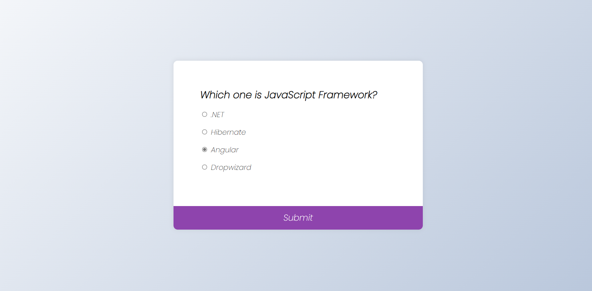
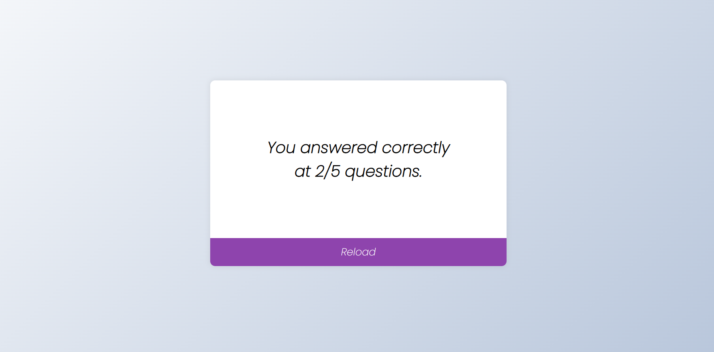

# Quiz App

## Table of Contents
* [General Info](#general-information)
* [Technologies Used](#technologies-used)
* [Features](#features)
* [Screenshots](#screenshots)

## General Information
Quiz- web application.

## Technologies Used
- JavaScript
- HTML
- CSS

## Features
- Choosing the answer with radio-buttons.

## Screenshots

